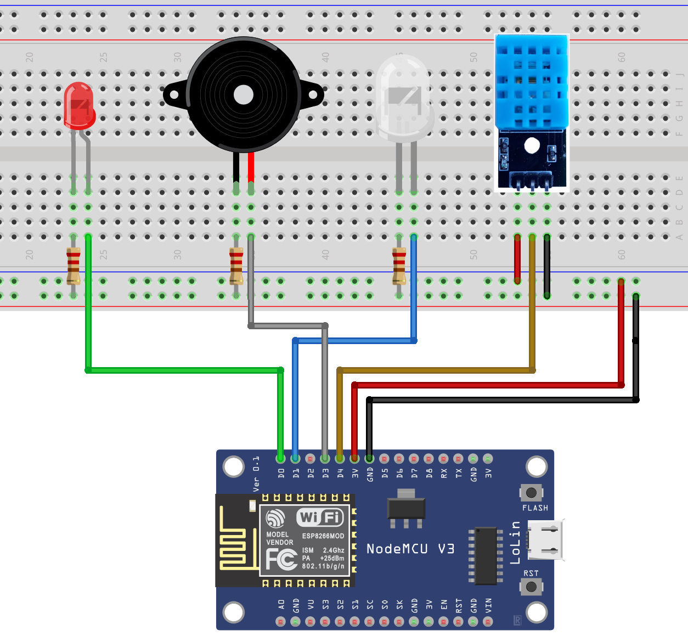
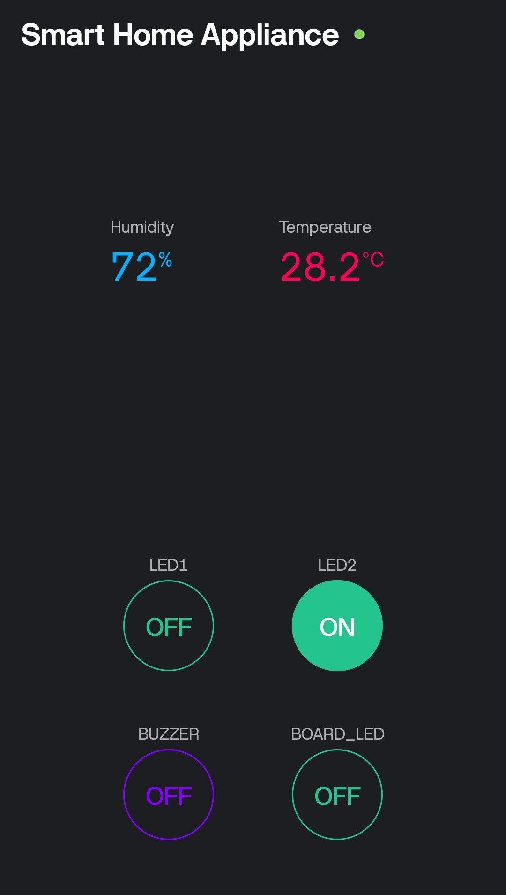
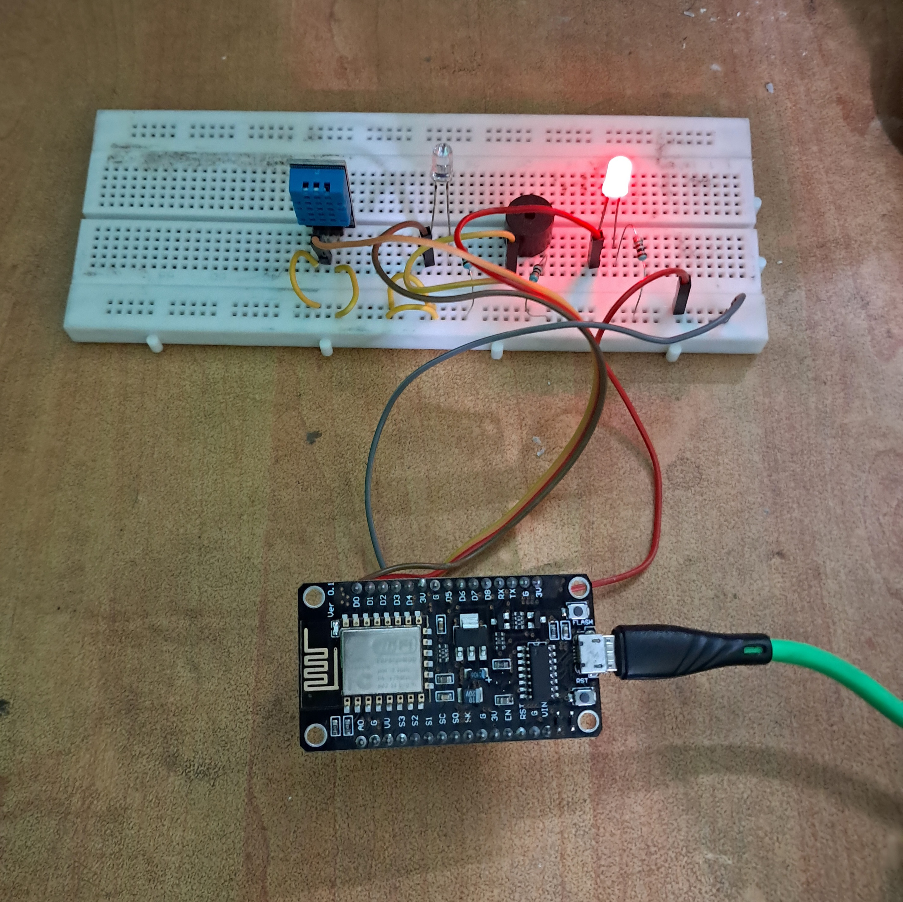

# Smart home appliances with esp8266

## Introduction

This is a prototype of a system with which we can control any electrical components using smartphone.
The system uses Blynk IOT platform to connect with the esp8266 controller with smartphone.

## Functionality

The system consists of a DHT11 sensor(to get the temperature and humidity data), 2 LEDs, and a Piezo buzzer. We can control any of these devices using Blynk IOT application through our smartphone. we can also monitor the temperature and the humidity of the surrounding.

## Components used

- esp8266 micro controller
- DHT11 sensor
- 2 LEDs 
- Piezo buzzer
- 100 $\Omega$ resistors (3)
- Jumper wires
- Breadboard
- Power supply (any)

## Circuit diagram

[Fritzing file](./resources/circuit.fzz)

## Blynk connections

| Virtual Pin | OUTPUT/INPUT |
| ----------- | ------------ |
| V0          | LED1         |
| V1          | LED2         |
| V2          | BUZZER       |
| V3          | Board led    |
| V4          | Temperature  |
| V5          | Humidity     |

## Blynk UI

## System image

## Dependencies

- ESP8266WiFi
- BlynkSimpleEsp8266
- DHT